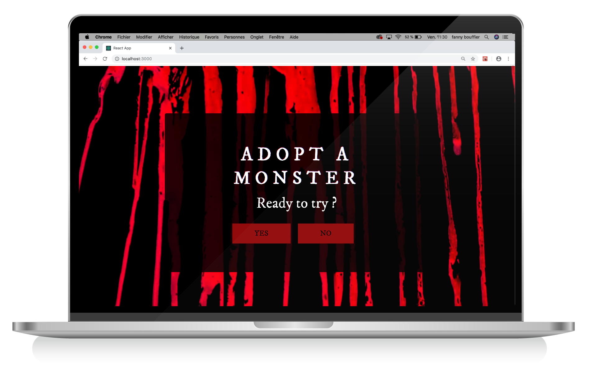
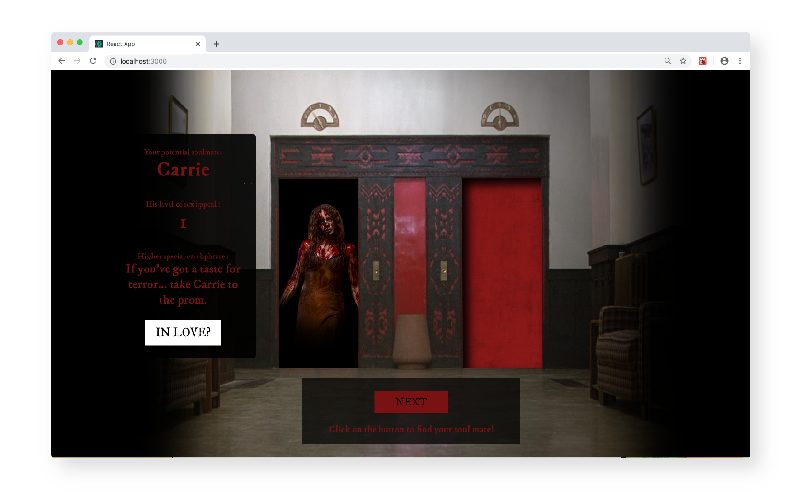
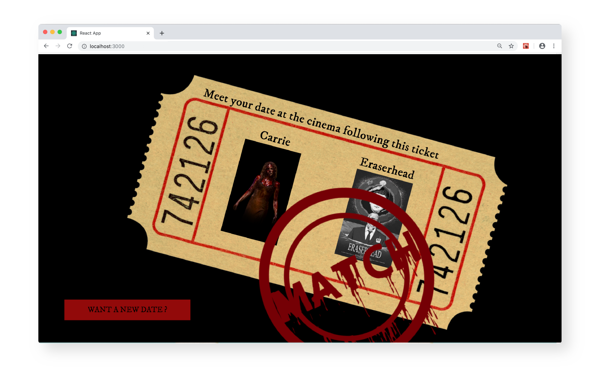

# Adopt a Monster ! (a 24h Wild Code School Hackathon Project)

A project done in 24h during an hackathon organized by the Wild Code School. A web app to meet your favorite monster/murderer inside the very bloody elevetor from Shining and go on a cinema date with him/her.
Main feature is based on an Homemade API request + Redux.

#### Homepage


#### Elevator Match


#### You have a Date!



#### Installation

```bash
git clone https://github.com/fanya3/Adopte-un-monstre.git
cd Adopte-un-monstre
npm install
```


[](http://forthebadge.com)

